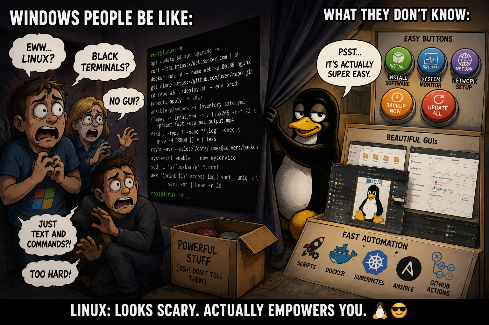
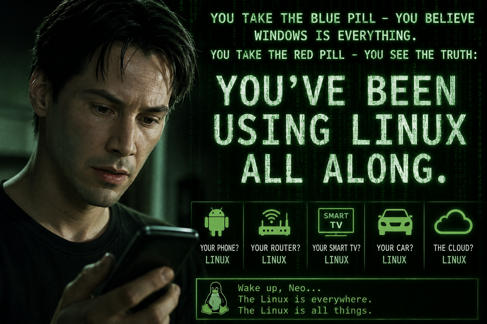
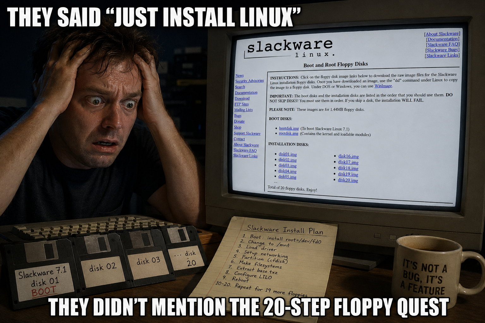
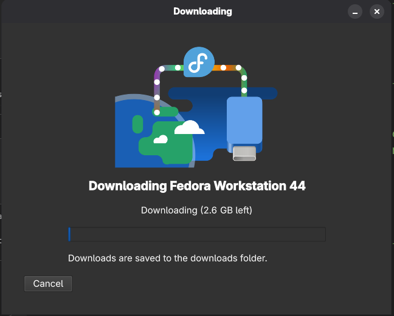
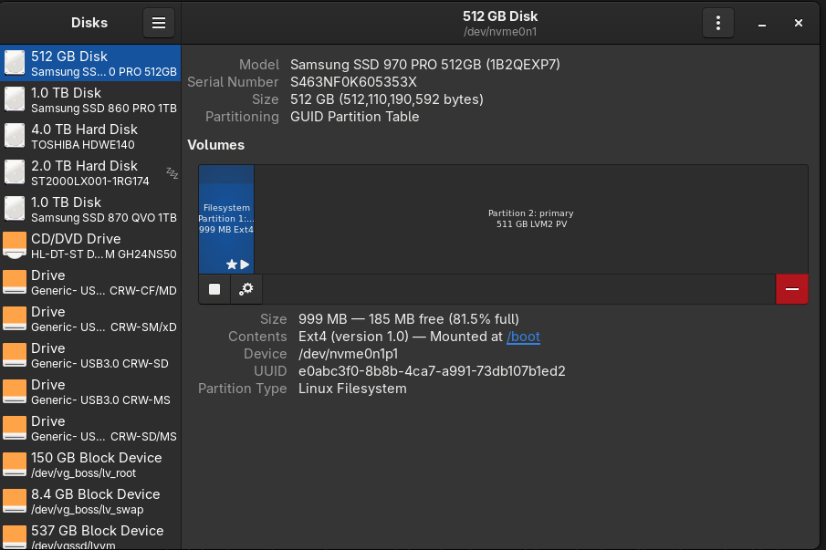
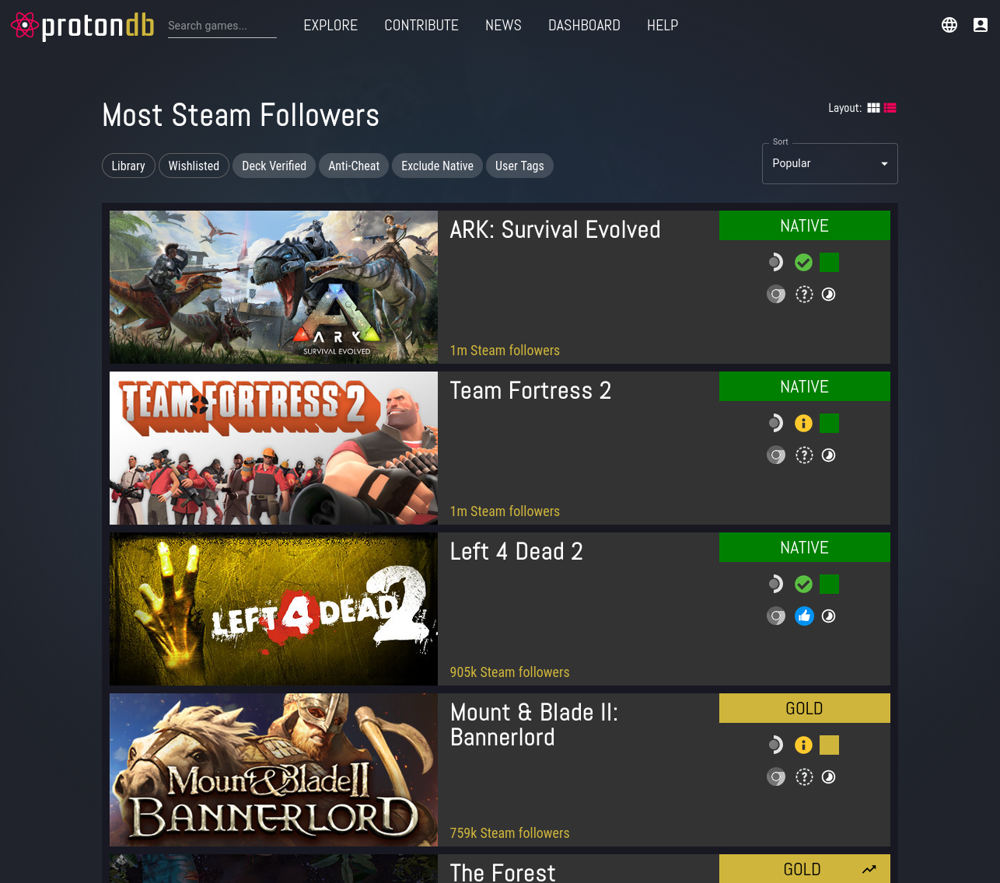

<!-- _paginate: false -->
<!-- _header: "" -->
<!-- _footer: "" -->
<!-- _class: lead welcome -->
<!-- _backgroundImage: "linear-gradient(to bottom, rgba(0, 0, 0, 0.2), rgba(0, 0, 0, 0.8)), url('images/fredlug-banner.jpg')" -->
<!-- _backgroundSize: auto -->
<!-- _backgroundPosition: top center -->

# Welcome to FREDLUG!
**June 2026**

We meet every 4th Saturday of the month
### Howell Branch Library · Stafford, VA

- Events: https://heylo.group/fredlug
- Mailinglist: https://lists.firemountain.net/mailman/listinfo/fredlug

<div class="footnote">v{{VERSION}} - https://github.com/fredlug-va/linuxforwindows</div>

---
<!-- _class: lead -->

# Linux for Windows Admins
## It's not as scary as you think

---

## Linux is "just" a kernel

- This talk is focused on Fedora and can easily apply to all Red Hat derrived distributions
- The wast majority discussed here, applies to a very wide spectrum of distributions
- To simplify, we just talk about Fedora today
  - Please add context or ask questions about other distributions if there's interest
- Linux and GNU are open source projects
  - GNU founded by Richard Stallman and created what we today know as Open Source (GPL)
  - Linux established by Linus Torvalds took inspiration from GNU and open sourced the kernel from day 1
  - Together they have punched IT into tomorrow and beyond

<!--
Ask the room: how many manage Windows servers? How many have touched a Linux box?
This helps calibrate how much Windows context to use throughout the talk.
-->

---

<!-- IMAGE: A meme or cartoon showing someone terrified at a Linux terminal -->
<!-- Suggestion: the "It doesn't have to be like this" slide from prior presentations -->
<!-- _class: fit-image -->

## It doesn't have to be like this



<!--
This is the core message of the whole talk.
Linux has a reputation — mostly from the 90s — of being hard, cryptic, and hostile.
That reputation is outdated. The goal today is to show that every scary thing has a familiar Windows equivalent.
-->

---

## Agenda

1. Why should a Windows admin care?
2. Getting Linux — it's stupidly easy now
3. The mental model shift
4. Services: `systemctl` vs. Services snap-in
5. Logs: `journalctl` vs. Event Viewer
6. Networking: `nmcli` vs. `netsh`
7. Software: `dnf` / Flatpak vs. `winget`
8. **Steam on Linux** — gaming with Flatpak + Proton
9. Users, `sudo` & SSH
10. Live demo: a web server in 5 commands
<!--
Point out that sections 4-9 each follow the same pattern:
"Here's the Linux thing, here's what you already know it as in Windows."
The goal is not to make them Linux experts today — it's to remove the fear.
-->

---
<!-- _paginate: false -->
<!-- _header: "" -->
<!-- _footer: "" -->
<!-- _class: section-divider -->

# Why Should a Windows Admin Care?

---
<!-- _header: 'FREDLUG | Linux Intro | Why Care?' -->

## The Numbers

- **3 billion+** Android devices run the Linux kernel
- **500 / 500** of the world's fastest supercomputers: Linux
- **60%+ of Azure** VM cores — on Microsoft's own cloud
- **96%** of the world's top 1 million web servers run Linux
- **NYSE, London Stock Exchange, Tokyo Stock Exchange**: Linux

You're not going into uncharted territory — you're tourist number 10 million.
<!--
Top500.org publishes twice-yearly rankings — Linux has owned the entire top 500 since November 2017.
Azure quote (Jack Aboutboul, Microsoft Azure Linux Platforms Group, Linux Foundation Open Source Summit):
"We started out as a Windows platform, and Linux is the number one OS being run on Azure today."
60%+ of Azure VM cores are Linux. 60%+ of Azure Marketplace offerings (~20,000 services) are Linux-based.
In 2001 Steve Ballmer called Linux "a cancer." Microsoft now employs a Linux Platforms Group to support it.
Web server stat: W3Techs survey of top 1M sites.
NYSE moved from Windows to Linux in 2007 after a trading outage — reliability driver, not ideology.
Good line for the audience: "Your Windows skills still matter. But the servers those skills connect to? Mostly Linux."
-->

<div class="footnote">Sources: Top500.org Nov 2024 · W3Techs 2024 · thenewstack.io/microsoft-linux-is-the-top-operating-system-on-azure-today</div>

---
<!-- _header: 'FREDLUG | Linux Intro | Why Care?' -->
<!-- _class: fit-image -->

## You're Already Using Linux

<!-- IMAGE: Humorous
<!--
Their Android phone: Linux kernel.
Their smart TV, their router, their Kindle: Linux.
The website they use for online banking: almost certainly running on Linux.
Most people have been using Linux daily for years — they just didn't know it.
--> "you are already using linux" meme — e.g. Neo from Matrix -->
<!-- Suggestion: man looking at phone/laptop with overlay text "You've been using Linux all along" -->



---
<!-- _header: 'FREDLUG | Linux Intro | Why Care?' -->

## Why Windows Admins Need Linux

- **Most new servers and cloud workloads run on Linux** — the market has shifted
- Containers (Podman, Docker, Kubernetes) run on Linux
- **Every major scripting and automation tool** — Bash, Python, Ansible, Terraform — was built for Linux first
- **Security patches ship faster** — no waiting for Patch Tuesday
- Cloud certifications increasingly require Linux
<!--
The job market angle: Linux skills appear in most sysadmin job postings now, even for primarily Windows shops.
Docker on Windows is still running a Linux VM underneath — you can't escape it.
Ansible, the most popular IT automation tool, is designed around SSH to Linux hosts.
RHCSA/RHCE certifications are highly valued and well-paying.
-->

---
<!-- _paginate: false -->
<!-- _header: "" -->
<!-- _footer: "" -->
<!-- _class: section-divider -->

# Getting Linux

---
<!-- _header: 'FREDLUG | Linux Intro | Getting Linux' -->
<!-- _class: fit-image -->

## Installing Linux ... in 1995
<!--
This is what people remember and why they think Linux is hard.
Multiple floppy disks, manually selecting kernel modules, hand-editing config files just to get X11 working.
IRQ conflicts. Compiling drivers. The horror was real — in 1998.
That world is gone. What comes next is what it looks like today.
-->

<!-- IMAGE: Old Slackware install guide or boot disk selection horror screen -->
<!-- Suggestion: screenshot of the old http://www.slackware.com/install/bootdisk.php page or the 20-step floppy disk process -->



---
<!-- _header: 'FREDLUG | Linux Intro | Getting Linux' -->

## Installation Today: One Tool

- Download **Fedora Media Writer** — free, runs on Windows
- Pick your Fedora edition (Workstation = desktop, Server = server)
- Insert USB stick — it does the rest
- Boot from USB — **live system, no install required to try it**

- The more manual way is heading to https://getfedora.org - or other distribution similars.
  * Download the image - use it directly with a VM, or
  * Write to USB using "dd"
  * Use image to boot new system from
<!--
Windows equivalent: the Windows Media Creation Tool — same concept exactly.
Download a tool, pick your version, write to USB, boot from it.
The "live system" feature is something Windows doesn't have — you can run a full Fedora desktop from the USB without touching the hard drive.
Great for trying Linux on hardware you're not ready to commit to.
-->

<div class="footnote">https://fedoraproject.org/workstation/download/</div>

---
<!-- _header: 'FREDLUG | Linux Intro | Getting Linux' -->
<!-- _class: fit-image -->

## Fedora Media Writer

<!-- IMAGE: Screenshot of Fedora Media Writer
<!--
Compare this directly to the Windows Media Creation Tool — same workflow.
Choose edition → choose destination → write.
Fedora Media Writer also runs on Windows and macOS, so Windows admins can create Linux USB drives without leaving Windows.
--> application - clean, simple UI -->



---
<!-- _header: 'FREDLUG | Linux Intro | Getting Linux' -->

## Best Way to Start: Virtual Machine

- No hardware risk — runs inside Windows
- Hyper-V, VirtualBox, VMware Workstation all work
- Give it 4GB RAM, 2 cores, 40GB disk
- Snapshot before you break things — restore in seconds
- Learn at your own pace
<!--
Hyper-V is already built into Windows 10/11 Pro — no software to install.
Enable it in "Turn Windows features on or off" → Hyper-V.
Snapshots = Windows "checkpoints" in Hyper-V terminology.
Strongly recommend VMs over dual-boot for beginners — no risk, easy to reset, run side by side.
-->

---
<!-- _paginate: false -->
<!-- _header: "" -->
<!-- _footer: "" -->
<!-- _class: section-divider -->

# The Mental Model Shift

---
<!-- _header: 'FREDLUG | Linux Intro | Mental Model' -->
<!-- _class: conf-table -->
<style scoped>
section.conf-table table { font-size: 0.65em; }
</style>

## Windows → Linux: Your Cheat Sheet

| Windows | Linux |
|---------|-------|
| `C:\`, `D:\`, drive letters | Everything under `/` |
| Registry | Config files in `/etc/` |
| Services snap-in | `systemctl` |
| Event Viewer | `journalctl` |
| `ipconfig` / `netsh` | `nmcli` / `ip addr` |
| `winget` / Chocolatey | `dnf` / `flatpak` |
| Task Manager | `top` / `htop` |
| Remote Desktop (RDP) | `ssh` |
| UAC prompt | `sudo` |
| Task Scheduler | `cron` / systemd timers |
<!--
Encourage people to photograph this slide — it's the Rosetta Stone for the rest of the talk.
Every section from here on maps to a row in this table. The concepts are identical; only the names and tools differ.

Windows terms explained:
- Services snap-in: the GUI in Server Manager / MMC for starting, stopping, and configuring Windows services.
- Event Viewer: Windows' centralised log viewer (eventvwr.msc) — shows System, Application, Security logs.
- ipconfig: shows IP address info. netsh: command-line network configuration tool (older, verbose).
- winget: Microsoft's built-in package manager, added in Windows 10/11. Install apps from the command line.
- Chocolatey: a popular THIRD-PARTY package manager for Windows that predates winget — similar idea, community-maintained repository of packages. Many shops still use it.
- Task Manager: the GUI for seeing running processes and resource usage (Ctrl+Shift+Esc).
- RDP / Remote Desktop: Windows' built-in remote desktop protocol — full graphical remote session.
- UAC: User Account Control — the "Do you want to allow this app to make changes?" dialog. Introduced in Vista.
- Task Scheduler: Windows' built-in job scheduler (taskschd.msc) — runs scripts/programs on a schedule.
-->

---
<!-- _header: 'FREDLUG | Linux Intro | Mental Model' -->
<!-- _class: ascii -->
<style scoped>
section.ascii pre { width: 90%; }
section.ascii pre code { font-size: 1.4em; }
</style>

## The Filesystem — No Drive Letters

```text
/                       ← root (like C:\ but everything lives here)
├── etc/                ← system config files (like Registry, but readable!)
├── home/
│   └── peter/          ← your files (like C:\Users\peter)
├── var/            
│   └── log/            ← logs
├── usr/
│   └── bin/            ← programs (like C:\Windows\System32)
├── tmp/                ← temp files, wiped on reboot
└── mnt/ or /media/     ← where USB drives and extra disks appear
```

No `C:\`, no `D:\` — **one tree, everything attached to it**

<!--
Windows: C:\ is your system drive, D:\ might be a data drive, E:\ might be a USB stick.
Linux: there is only one tree. Additional drives are "mounted" as directories inside it.
/home/peter is exactly like C:\Users\peter — same purpose.
/usr/bin is where installed programs live — like C:\Windows\System32 or C:\Program Files.
Admins who manage Windows file servers: think of it like DFS — one namespace, multiple physical locations underneath.
-->


---
<!-- _header: 'FREDLUG | Linux Intro | Mental Model' -->
<!-- _class: two-col -->
<style scoped>
.two-col-layout.arch-layout { grid-template-columns: 54% 44%; }
</style>

## Adding Disks: Mount Points, Not Drive Letters

<div class="two-col-layout arch-layout">
<div class="arch-text">

```bash
# What's plugged in?
lsblk

# What's currently mounted?
mount | column -t

# Add a new disk — 3 steps:
mkfs.xfs /dev/sdb       # 1. Format it
mkdir /data             # 2. Create mount point
mount /dev/sdb /data    # 3. Attach to the tree

# Survive a reboot — add to /etc/fstab:
echo "/dev/sdb /data xfs defaults 0 0" >> /etc/fstab
```

</div>
<div class="arch-image">



</div>
</div>

<!--
Windows equivalent: Disk Management (diskmgmt.msc) → right-click unallocated → New Simple Volume → wizard → assign drive letter.
On Linux there's no drive letter to fight over, no wizard, no reboot required.
The mount point is just a directory — /data, /backup, /mnt/nas — you name it whatever makes sense.
lsblk is the Linux equivalent of the disk list in Disk Management — shows all block devices, their sizes, and what's mounted where.
/etc/fstab is read by systemd at boot via systemd-fstab-generator — it auto-creates .mount units from it. Still the simplest and most universal way to make mounts persist.
DFS analogy: Linux admins who manage file servers think of this exactly like DFS namespaces — one path, multiple physical locations underneath.
USB drives: modern Linux (with udisks2) mounts them automatically under /media/username/label — same as Windows Explorer auto-mounting to a drive letter.
-->

---
<!-- _header: 'FREDLUG | Linux Intro | Mental Model' -->

## Configuration: Less Registry, More Transparency

- System config: plain text files in `/etc/` — readable, diffable, versionable
- GNOME/desktop apps use **GSettings** — a registry-like store, scoped to user preferences
- No system-critical settings buried in a binary database
- Servers often have zero GUI — pure text config, nothing else

```bash
cat /etc/hostname               # What's this machine called?
cat /etc/hosts                  # Local DNS overrides
gsettings get org.gnome.desktop.interface color-scheme
```
<!--
System config in /etc/ is the part that matters most for server admins — and it's plain text throughout.
git diff /etc/ answers "what changed on this server last week?" cleanly; try that with the Windows Registry.
GSettings/dconf: yes, GNOME has a registry-like store for desktop preferences. It's scoped to user apps, not system administration.
"gsettings" is more approachable than regedit — readable schemas, queryable from the command line.
/etc/hosts is identical to C:\Windows\System32\drivers\etc\hosts — Windows admins already know this one.
On a headless server there's no GSettings at all — purely text files.
-->

---
<!-- _header: 'FREDLUG | Linux Intro | Mental Model' -->

## Two Things That Will Bite You

**Case sensitivity:**
- `Documents` ≠ `documents` ≠ `DOCUMENTS`
- They are different names (file or directory)

**File permissions:**
- Every file has an owner, a group, and permissions
- `ls -l` shows you who can do what
- `chmod` and `chown` change them
- Regular users **cannot** damage system files
<!--
Case sensitivity: Windows NTFS is case-insensitive by default. Linux ext4/xfs are always case-sensitive.
Scripts copied from Windows that reference "Config.txt" will fail silently if the file is named "config.txt".
File permissions: Windows has NTFS ACLs with complex inheritance. Linux uses a simpler owner/group/other model.
"ls -l" → like right-clicking a file and choosing Properties → Security in Windows Explorer.
"chmod 644" → Read for everyone. "chmod 755" → Read+Execute for everyone, Write for owner only.
-->

---
<!-- _header: 'FREDLUG | Linux Intro | Mental Model' -->

## File Permissions: The Basics

```bash
$ ls -l ideas-for-christmas.txt 
-rw-r--r--. 1 peter family 158 Jun 19 15:41 ideas-for-christmas.txt
# owner: rw-   group: r--   other: r--

chmod u+x myscript.sh         # give owner/user execute
chmod g+rw,o= report.txt      # group read+write, others nothing
chmod a+r public.html         # everyone can read  (a = all)
chown alice:nobody myfile.txt # change owner and group
```

There's a lot more — ACLs, SELinux, capabilities — but `chmod` gets you through most days.
<!--
Windows equivalent: right-click → Properties → Security → Advanced → ACL entries.
Linux's basic model: every file has owner (u), group (g), and other (o). Each gets read/write/execute.
Symbols: u=user/owner, g=group, o=other, a=all. Operators: + adds, - removes, = sets exactly.
Octal shorthand also works (chmod 644, chmod 755) — you'll see it in docs and scripts, but the symbolic form is clearer.
644 = u+rw,g=r,o=r. 755 = u+rwx,g=rx,o=rx.
The dot after permissions (rw-r--r--.) means SELinux context is set — don't worry about it yet.
If something is "permission denied" and permissions look right: check ownership first, then SELinux.
-->

---
<!-- _paginate: false -->
<!-- _header: "" -->
<!-- _footer: "" -->
<!-- _class: section-divider -->

# Services

---
<!-- _header: 'FREDLUG | Linux Intro | Services' -->

## `systemctl` = Services Snap-in (But Better)

- `systemd` manages everything that runs on the system
- Start, stop, enable, disable — same concepts you know
- Status output shows logs inline — no hunting Event Viewer
- One tool for both services and boot targets
<!--
Windows: services.msc (Services snap-in) or Get-Service in PowerShell.
Linux: systemctl. Same verbs, different syntax.
The big difference: systemctl status shows you recent log output right there in the terminal.
In Windows, you'd have to open Event Viewer separately and filter by the service name.
systemd startup types: enabled = Automatic, disabled = Disabled (but can be started manually).
-->


---

<!-- _header: 'FREDLUG | Linux Intro | Services' -->
<!-- _class: conf-table -->
<style scoped>
section.conf-table table { font-size: 0.65em; }
section.conf-table p { font-size: 0.72em; margin-top: 0.4em; }
</style>

## Services: Windows vs Linux

| Windows | Linux (`systemctl`) |
|---------|---------------------|
| Start service | `systemctl start <name>` |
| Stop service | `systemctl stop <name>` |
| Restart service | `systemctl restart <name>` |
| Set to Disabled | `systemctl disable <name>` |
| Auto-start at boot + start now | `systemctl enable --now <name>` |
| View service status | `systemctl status <name>` |
| List all services | `systemctl list-units --type=service` |

One tool. Consistent syntax. Windows has `sc.exe`, `net start/stop`, and PowerShell — all doing the same thing differently.

<!--
Reference slide — give the audience a moment to photograph this.
The service name in Linux is usually the package name: sshd, httpd, firewalld, NetworkManager.
On Windows, service names are often cryptic (wuauserv = Windows Update, spooler = Print Spooler).
Linux service names are generally human-readable.
Windows CLI options — three of them, inconsistent syntax:
- sc.exe: sc start <svc> / sc stop <svc> / sc config <svc> start= auto
- net commands: net start <svc> / net stop <svc>
- PowerShell: Start-Service / Stop-Service / Restart-Service / Set-Service
"systemctl status" shows recent log output inline — none of the Windows CLI tools do that.
-->

---
<!-- _paginate: false -->
<!-- _header: "" -->
<!-- _footer: "" -->
<!-- _class: section-divider -->

# Logs

---
<!-- _header: 'FREDLUG | Linux Intro | Logs' -->

## Event Viewer → `journalctl`

- `journald` collects logs from **everything**: kernel, services, apps
- Structured, searchable, filterable — not a flat text file
- Built into every modern Linux system
- No more navigating 6 levels of Event Viewer menus

```bash
journalctl              # All logs (pipe to less automatically)
journalctl -f           # Follow live (like tail -f)
journalctl -b           # Logs since this boot only
```

<!--
Windows Event Viewer: Windows Logs → Application, System, Security — separate buckets.
Linux journald: one unified log store for everything — kernel, services, user programs, all searchable together.
"journalctl -f" is equivalent to watching Event Viewer with auto-refresh — new entries appear as they happen.
"-b" (boot) is like filtering Event Viewer by logged time since last boot.
No XML, no GUI required — just run the command.
-->

---
<!-- _header: 'FREDLUG | Linux Intro | Logs' -->

## Filter Logs Like a Pro

```bash
# Logs for one service (like filtering by Source in Event Viewer)
journalctl -u httpd

# Since last boot, for SSH
journalctl -u sshd -b 0

# Last 50 lines
journalctl -u httpd -n 50

# Between timestamps
journalctl --since="2026-06-27 09:00" --until="2026-06-27 10:00"

# Errors only
journalctl -p err -b
```

<!--
Windows Event Viewer mapping:
- "-u httpd" → Filter Current Log → Event sources → select "Apache"
- "-b 0" → Filter by date/time since last boot
- "-n 50" → viewing the last N events
- "--since/--until" → Filter by date/time range
- "-p err" → Filter by Level → Error or Critical
Key advantage: all of this is one command with flags vs. clicking through multiple dialog boxes.
You can also pipe journalctl output to grep for further filtering — Event Viewer has no equivalent.
-->

---
<!-- _paginate: false -->
<!-- _header: "" -->
<!-- _footer: "" -->
<!-- _class: section-divider -->

# Networking

---
<!-- _header: 'FREDLUG | Linux Intro | Networking' -->

## NetworkManager: One Place for Everything

- Manages wired, WiFi, VPN, bridges, bonds — all in one tool
- Reacts automatically to network changes
- GUI in GNOME, CLI with `nmcli`, web UI via Cockpit
- No more hunting through adapter settings in Control Panel

```bash
nmcli device status     # Show all network interfaces
nmcli connection show   # Show all connections (like saved adapters)
```

<!--
Windows equivalent: Network and Sharing Center in Control Panel, or the Network Connections window (ncpa.cpl).
NetworkManager is the single daemon that handles everything — wired, wireless, VPN, bridges.
nmcli is the CLI — like using "netsh" on Windows but with readable output and logical commands.
Cockpit is a web-based admin panel (like a lightweight web Server Manager) — covers networking, services, storage.
-->

---
<!-- _header: 'FREDLUG | Linux Intro | Networking' -->

## What's what?

```
$ ip address | grep eno
2: eno1: <BROADCAST,MULTICAST,SLAVE,UP,LOWER_UP> mtu 1500 qdisc mq master bond0 state UP group default qlen 1000
3: eno5: <BROADCAST,MULTICAST,UP,LOWER_UP> mtu 9000 qdisc mq state UP group default qlen 1000
4: eno2: <BROADCAST,MULTICAST,SLAVE,UP,LOWER_UP> mtu 1500 qdisc mq master bond0 state UP group default qlen 1000
5: eno3: <NO-CARRIER,BROADCAST,MULTICAST,UP> mtu 1500 qdisc mq state DOWN group default qlen 1000
6: eno6: <BROADCAST,MULTICAST,UP,LOWER_UP> mtu 1500 qdisc mq state UP group default qlen 1000
7: eno4: <NO-CARRIER,BROADCAST,MULTICAST,UP> mtu 1500 qdisc mq state DOWN group default qlen 1000
8: eno7: <NO-CARRIER,BROADCAST,MULTICAST,UP> mtu 1500 qdisc mq state DOWN group default qlen 1000
9: eno8: <NO-CARRIER,BROADCAST,MULTICAST,UP> mtu 1500 qdisc mq state DOWN group default qlen 1000
15: eno5.20@eno5: <BROADCAST,MULTICAST,UP,LOWER_UP> mtu 9000 qdisc noqueue state UP group default qlen 1000
    inet 192.168.20.81/24 brd 192.168.20.255 scope global noprefixroute eno5.20
``` 

---
<!-- _header: 'FREDLUG | Linux Intro | Networking' -->
## NetworkManager is user friendly

```
$ nmcli device
DEVICE                     TYPE           STATE                   CONNECTION                       
br-ex                      ovs-interface  connected               ovs-if-br-ex                     
eno6                       ethernet       connected               Wired connection 6                 
eno5.20                    vlan           connected               eno5.20                            
bond0                      bond           connected               ovs-if-phys0                     
eno1                       ethernet       connected               Wired connection 1-slave-ovs-clone 
eno2                       ethernet       connected               Wired connection 2-slave-ovs-clone 
eno5                       ethernet       connected               eno5                             
br-ex                      ovs-bridge     connected               br-ex                            
bond0                      ovs-port       connected               ovs-port-phys0                   
br-ex                      ovs-port       connected               ovs-port-br-ex 
```

---
<!-- _header: 'FREDLUG | Linux Intro | Networking' -->

## Basic Network Commands

```bash
# What's my IP? (replaces ipconfig)
ip addr show
nmcli device show

# What's my default route? (replaces route print)
ip route show

# Is this host reachable?
ping 8.8.8.8

# What's listening on which port? (replaces netstat -an)
ss -tlnp
```

<!--
Windows mapping line by line:
- "ip addr show" → ipconfig /all
- "ip route show" → route print
- "ping 8.8.8.8" → ping 8.8.8.8 (identical!)
- "ss -tlnp" → netstat -an (netstat still works on Linux too)
Interface names: Linux uses predictable names like "enp1s0" instead of "Ethernet".
"en" = ethernet, "p1" = PCI bus 1, "s0" = slot 0 — verbose, but identifies the exact physical port.
-->

---
<!-- _header: 'FREDLUG | Linux Intro | Networking' -->

## Setting a Static IP

```bash
# List interfaces
nmcli device

# Set static IP (replaces the Properties → TCP/IP dialog)
nmcli connection modify "Wired connection 1" \
  ipv4.method manual \
  ipv4.addresses 192.168.1.50/24 \
  ipv4.gateway 192.168.1.1 \
  ipv4.dns 8.8.8.8

# Apply it
nmcli connection up "Wired connection 1"
```

<!--
Windows equivalent: Network Connections → right-click adapter → Properties → Internet Protocol Version 4 → Use the following IP address.
The nmcli approach is scriptable and repeatable — paste it into a runbook and it works every time.
Settings are saved permanently — unlike temporary Windows "ipconfig /ip" changes.
The connection name "Wired connection 1" maps to a Windows connection profile name.
-->

<div class="footnote">Interface names like enp1s0 are predictable — "en" = ethernet, "p1" = PCI bus 1, "s0" = slot 0</div>

---
<!-- _header: 'FREDLUG | Linux Intro | Networking' -->
<!-- _class: conf-table -->

## Networking: Windows vs Linux

| Windows | Linux |
|---------|-------|
| `ipconfig` | `ip addr` / `nmcli device show` |
| `route print` | `ip route show` |
| `netstat -an` | `ss -tlnp` |
| `netsh` | `nmcli` |
| `ping` | `ping` (same!) |
| `nslookup` | `dig` / `nslookup` (same!) |
| `tracert` | `traceroute` / `mtr` |
<!--
Good news: ping and nslookup work identically on both platforms — same flags, same output format.
tracert on Windows = traceroute on Linux. "mtr" combines ping and traceroute into a live view.
netsh on Windows is notoriously hard to use — nmcli is similar in power but with more readable syntax.
"ss" replaces the deprecated "netstat" — though netstat still works on most Linux systems.
-->

---
<!-- _paginate: false -->
<!-- _header: "" -->
<!-- _footer: "" -->
<!-- _class: section-divider -->

# Software

---
<!-- _header: 'FREDLUG | Linux Intro | Software' -->

## `dnf`: Software the Right Way

- Installs from **trusted repositories** — no random EXEs
- Handles dependencies automatically
- Updates the entire system with one command
- Completely reversible

```bash
sudo dnf install nginx          # Install software
sudo dnf remove nginx           # Uninstall it
sudo dnf update                 # Update everything (like Windows Update)
sudo dnf search "web server"    # Find software by keyword
dnf info httpd                  # Details about a package
```

<!--
Windows equivalents:
- "dnf install" → winget install or choco install (but without needing to find a third-party source)
- "dnf remove" → Programs and Features → Uninstall, or winget uninstall
- "dnf update" → Windows Update (but it updates ALL software, not just the OS)
- "dnf search" → searching in Microsoft Store or Chocolatey
Key difference: dnf updates your browser, text editor, server software — everything at once.
Windows Update only updates Windows itself; everything else updates itself separately.
dnf automatically installs everything a package needs — you never see "missing DLL" errors.
-->

---
<!-- _header: 'FREDLUG | Linux Intro | Software' -->

## Flatpak: Universal App Packaging

- Sandboxed applications from **Flathub** — one repo, all distros
- Keeps apps isolated from the system
- Great for desktop apps: browsers, media players, games
- Works on any Linux distribution

```bash
# Enable Flathub (one-time setup on Fedora)
flatpak remote-add --if-not-exists flathub \
  https://dl.flathub.org/repo/flathub.flatpakrepo

# Install any app
flatpak install flathub org.videolan.VLC
flatpak run org.videolan.VLC
```

<!--
Windows equivalent: Microsoft Store — a curated app store with sandboxed applications.
Flathub is like the Microsoft Store but for all Linux distributions, not tied to one vendor.
The sandboxing means Flatpak apps can't poke around in system files — similar to UWP apps on Windows.
Flatpak is especially useful for desktop apps that ship faster than the distro's repo (Steam, Spotify, VS Code).
-->

<div class="footnote">https://flathub.org</div>

---
<!-- _header: 'FREDLUG | Linux Intro | Software' -->
<!-- _class: conf-table -->

## The Desktop is Optional

<style scoped>
section.conf-table table { font-size: 0.72em; }
</style>

| Graphical UI | Feel | Best for |
|--------------|------|----------|
| **GNOME** | Clean, minimal, modern | Newcomers, macOS refugees |
| **KDE Plasma** | Feature-rich, configurable | Windows users, power users |
| **XFCE** | Lightweight, traditional | Old hardware, VMs |
| **MATE** | Classic "Windows 7" style | Familiarity over novelty |
| **LXDE / LXQt** | Ultra-light | Raspberry Pi, thin clients |
| **None** | CLI only | Servers, containers, VMs |

Windows gives you one desktop. Linux gives you a choice.
<!--
Windows admins: think of it like choosing between Server Core (headless) and Server with Desktop Experience — except with 20 options, not 2.
GNOME is the default on Fedora and RHEL. KDE is default on openSUSE.
For servers: no desktop installed at all is the norm — same as Windows Server Core.
If you're running a VM or container for sysadmin tasks, there's no GUI and no overhead.
The desktop environment has zero effect on how the OS works underneath — same kernel, same commands.
-->

---
<!-- _header: 'FREDLUG | Linux Intro | Software' -->

## No Random EXEs From the Internet

- Software comes from **signed, verified repositories**
- No "download setup.exe from some website"
- No bundled crapware in installers
- Updates all software at once — not just the OS

This is one of the biggest security wins over Windows for admins.
<!--
This is a massive cultural difference. Windows trains users to find and download EXE files from websites.
That EXE could be anything — malware, adware, a legitimate installer wrapped with toolbar installers.
On Linux: software comes from the distribution's repositories. Packages are signed with GPG keys.
The closest Windows equivalent is "only install from the Microsoft Store" — not realistic for most software.
For admins managing end users: this is a huge reduction in support calls about malware and "my computer is slow."
-->

---
<!-- _paginate: false -->
<!-- _header: "" -->
<!-- _footer: "" -->
<!-- _class: section-divider -->

# Steam on Linux

---
<!-- _header: 'FREDLUG | Linux Intro | Steam' -->
<!-- _class: fit-image -->

## Gaming on Linux Has Arrived

<!-- IMAGE: Humorous
<!--
"The year of the Linux desktop" has been a running joke in the Linux community for 20+ years.
The Steam Deck changed everything. Valve shipped millions of Linux-based gaming handhelds.
Game developers now test on Linux. Anti-cheat software now supports Linux.
For Windows admins: this is also the most convincing argument to show their spouse/partner/kids why Linux is viable at home.
--> "the year of the Linux desktop is now" meme, or Tux playing games -->
<!-- Suggestion: Tux wearing a gaming headset, or Steam Deck promotional image -->


---
<!-- _header: 'FREDLUG | Linux Intro | Steam' -->

## Installing Steam: One Command

```bash
# Install Steam via Flatpak from Flathub
flatpak install flathub com.valvesoftware.Steam

# Launch it
flatpak run com.valvesoftware.Steam
```

That's it. Fully sandboxed, auto-updates, no dependencies to manage.

- Login with your existing Steam account
- Your library is right there

<!--
Windows equivalent: downloading the Steam installer from steampowered.com and running setup.exe.
The Flatpak version is sandboxed and auto-updates without running a background service.
Same Steam account, same library, same friends list. Nothing changes on the Steam side.
-->

---
<!-- _header: 'FREDLUG | Linux Intro | Steam' -->

## Proton: Windows Games on Linux

- Valve's compatibility layer — built on Wine + many patches
- Bundled directly in Steam — no setup needed
- Enable it: Steam → Settings → Compatibility → **Enable Steam Play for all titles**
- Thousands of Windows games run without modification

<!--
Wine is a compatibility layer that translates Windows API calls to Linux system calls.
Think of it like WSL in reverse — WSL translates Linux calls to Windows, Proton translates Windows calls to Linux.
Proton is Valve's heavily patched fork of Wine with DirectX-to-Vulkan translation (DXVK/VKD3D).
Anti-cheat: Easy Anti-Cheat and BattlEye now support Linux/Proton natively. Valve worked with both companies.
You don't configure Wine manually — Proton is bundled with Steam and updates automatically.
Enable path: Steam → Settings → Compatibility → ✅ Enable Steam Play for all titles → ✅ Use this tool for all other titles: Proton (latest)
-->

---
<!-- _header: 'FREDLUG | Linux Intro | Steam' -->
<!-- _class: fit-image -->

## ProtonDB: Check Before You Play

<!--
ProtonDB is a community-maintained database of game compatibility reports.
Ratings: Platinum (works perfectly), Gold (works with minor tweaks), Silver (some issues), Bronze (barely runs).
Windows equivalent: checking PCGamingWiki for compatibility notes — same idea, different platform.
Many reports include specific Steam launch options to copy-paste.
Image: protondb.com showing a popular game with a Gold or Platinum rating.
-->



<div class="footnote">https://protondb.com — community-reported compatibility for thousands of games</div>

---
<!-- _header: 'FREDLUG | Linux Intro | Steam' -->

## The Numbers

- **Steam Deck** ships with Linux (SteamOS) — millions sold
- **18,000+** games verified or playable on Linux via Proton
- Games that "just work": Elden Ring, Cyberpunk 2077, Deep Rock Galactic
- Native Linux titles: Dota 2, CS2, Baldur's Gate 3

This is what finally convinced many Windows users to make the switch.
<!--
The Steam Deck is significant: a commercial product sold at Best Buy, not a hobbyist device.
Valve has financial incentive to make Linux gaming work — they sell hardware that runs it.
Baldur's Gate 3 was developed on Linux first — a sign of how far things have come.
For Windows admins: the practical test is "can I play the games I already own?" — for most people the answer is yes.
-->

<div class="footnote">Source: ProtonDB statistics, Valve Steam Deck figures 2024</div>

---
<!-- _paginate: false -->
<!-- _header: "" -->
<!-- _footer: "" -->
<!-- _class: section-divider -->

# Users, sudo & SSH

---
<!-- _header: 'FREDLUG | Linux Intro | sudo & SSH' -->

## `sudo`: Your First Tool for Elevated Access

- Regular users **cannot** damage the system
- `sudo` grants temporary elevated privileges — per command
- Logs every `sudo` command: who ran what, when
- Configurable: limit what each user can `sudo` to

```bash
sudo systemctl restart httpd    # Run this one command as root
sudo -i                         # Open a root shell (use sparingly)
sudo !!                         # Re-run last command as root 😅
```
<!--
sudo = "superuser do" — runs one command with root privileges, then drops back to normal user.
It's the practical tool you'll use on most Linux servers (including Ansible) — not the whole security story.
Linux's actual security model goes much deeper: SELinux, polkit, capabilities, namespaces — but sudo is where you start.
Unlike Windows domain admin ("everything on the network is yours"), sudo is per-command and logged.
sudo can restrict specific users to specific commands — finer-grained than Windows local admin.
"sudo !!" re-runs the previous command with sudo — for when you forget to type sudo first.
-->

---
<!-- _header: 'FREDLUG | Linux Intro | sudo & SSH' -->
<!-- _class: fit-image -->

## The Classic sudo Moment

<!-- IMAGE: XKCD #149 "sudo make me a sandwich" comic -->
<!-- URL: https://xkcd.com/149/ — free to use, widely recognized -->


<div class="footnote">https://xkcd.com/149/</div>
<!--
Every Linux admin knows this comic. It captures the sudo concept perfectly.
"Make me a sandwich" → permission denied. "sudo make me a sandwich" → done immediately.
Good moment to pause and let the audience appreciate the humor.
-->

---
<!-- _header: 'FREDLUG | Linux Intro | sudo & SSH' -->

## SSH: Your New Remote Desktop

- Encrypted terminal access to any Linux system
- Lighter than RDP — works over any connection
- **Key-based auth**: no password, no brute force risk
- Can tunnel other traffic through the connection

```bash
# Connect to a server (like RDP but in the terminal)
ssh peter@192.168.1.100

# Connect as a specific user
ssh -l admin myserver.example.com
```

<!--
Windows equivalent: Remote Desktop Protocol (RDP) — mstsc.exe.
SSH gives you a terminal session; RDP gives you a full GUI desktop. For server admin, a terminal is usually enough.
SSH uses much less bandwidth than RDP — works fine over slow VPNs or mobile connections.
Windows admins who use PuTTY for SSH to switches/firewalls already know this — same tool, same protocol.
SSH port 22 = RDP port 3389 — the port that needs to be open in the firewall.
-->

---
<!-- _header: 'FREDLUG | Linux Intro | sudo & SSH' -->

## SSH Keys: No More Passwords

```bash
# Generate a key pair (one time — keep the private key safe)
ssh-keygen -t ed25519 -C "peter@workstation"

# Copy your public key to a server (then never type a password again)
ssh-copy-id peter@myserver

# Now connect — no password prompt
ssh peter@myserver
```

Private key stays on your machine. Public key goes on servers. Zero passwords over the wire.
<!--
Windows equivalent: certificate-based RDP authentication or smart card login — same public/private key concept.
Private key = your ID card. Public key = the list of authorized cards on the server.
"ssh-copy-id" is the Linux equivalent of exporting your certificate and importing it on the remote machine — one command.
ed25519 is the modern key algorithm — more secure and faster than older RSA. Always use ed25519 for new keys.
Ansible uses SSH keys exclusively for connecting to managed hosts — this is why key setup matters for automation.
-->

---
<!-- _paginate: false -->
<!-- _header: "" -->
<!-- _footer: "" -->
<!-- _class: section-divider -->

# Live Demo

---
<!-- _header: 'FREDLUG | Linux Intro | Demo' -->

## A Web Server in 5 Commands

```bash
# 1. Install Apache
sudo dnf install -y httpd

# 2. Start it and enable it at boot
sudo systemctl enable --now httpd

# 3. Open the firewall
sudo firewall-cmd --add-service=http --permanent && sudo firewall-cmd --reload

# 4. Check it's running
systemctl status httpd

# 5. Check the logs
journalctl -u httpd -n 20
```

<div class="footnote">
Demo page: <a href="https://raw.githubusercontent.com/fredlug-va/linuxforwindows/main/demo-index.html" style="color:#00d4aa;">raw.githubusercontent.com/fredlug-va/linuxforwindows/main/demo-index.html</a>
</div>

<!--
Windows equivalent walkthrough — so the audience can follow along:
1. dnf install httpd → Server Manager → Add Roles → Web Server (IIS) → wizard → possibly reboot
2. systemctl enable --now → set service to Automatic and Start
3. firewall-cmd → Windows Defender Firewall → Inbound Rules → New Rule → TCP 80 → Allow
4. systemctl status → Services snap-in or browser to localhost
5. journalctl → Event Viewer → Windows Logs → Application → filter by IIS source
Total Windows time: ~15 minutes of wizard clicking. Total Linux time: under 60 seconds.
-->

---
<!-- _header: 'FREDLUG | Linux Intro | Demo' -->

## What Just Happened?

- **Package manager** found, downloaded, and installed Apache — no wizard
- **systemd** started the service and registered it for boot
- **firewalld** opened port 80 in the firewall — permanently
- **journalctl** showed the service logs inline

Total keystrokes: less than a minute.  
On Windows: ~15 minutes of clicking through IIS install wizard.
<!--
Tie each step back to the cheat sheet from earlier:
- dnf = winget/Chocolatey
- systemctl = Services snap-in
- firewall-cmd = Windows Defender Firewall rules
- journalctl = Event Viewer

This demo is the "easy button" moment — everything the audience was afraid of has a familiar equivalent.
Ask: "Who could put these 5 commands in a shell script and deploy 50 web servers automatically?"
On Windows: PowerShell DSC, Group Policy, or SCCM — much more complex tooling required.
-->

---
<!-- _paginate: false -->
<!-- _header: "" -->
<!-- _footer: "" -->
<!-- _class: section-divider -->

# Where to Go From Here

---
<!-- _header: 'FREDLUG | Linux Intro | Resources' -->

## Try It Today

- **Fedora Workstation** — best starting point for a desktop
- **Fedora Server** — for server practice (minimal, no GUI)
- Run it in a VM on your existing Windows machine
- Hyper-V is built into Windows 10/11 Pro — free, already there

Don't dual-boot. Don't wipe your machine. Just spin up a VM.
<!--
Hyper-V: Turn Windows features on or off → Hyper-V → OK.
Then download the Fedora ISO, create a new VM, point it at the ISO, boot.
Fedora Workstation is the easiest starting point — GNOME desktop, familiar enough for Windows users.
Fedora Server is better for admins who want to practice the command-line tools shown today.
The VM approach means you can switch between Windows and Linux in seconds.
-->

---
<!-- _header: 'FREDLUG | Linux Intro | Resources' -->

## Learning Resources

- **Fedora Docs**: docs.fedoraproject.org — excellent, well-maintained
- **Ask Fedora**: ask.fedoraproject.org — community Q&A
- **Red Hat Training**: free introductory courses at redhat.com/training
- **Linux Journey**: linuxjourney.com — beginner-friendly interactive course
- **tldr pages**: `tldr <command>` — practical examples for any command

```bash
sudo dnf install tldr
tldr tar    # Finally understand tar flags
```
<!--
Windows admin equivalent resources:
- Fedora Docs → Microsoft Docs (docs.microsoft.com)
- Ask Fedora → Microsoft Q&A or TechNet forums
- Red Hat Training → Microsoft Learn (free courses, same model)
- tldr → "Get-Help" in PowerShell, but with practical examples instead of formal docs
The "man" command is the built-in manual for every Linux command — "man systemctl" gives the full reference.
RHCSA (Red Hat Certified System Administrator) is the most recognized Linux certification for enterprise admins.
-->

---
<!-- _header: 'FREDLUG | Linux Intro | FREDLUG' -->

## Join FREDLUG

- **Fredericksburg Linux Users Group**
- Meets every **4th Saturday** of the month
- **Howel Branch Library** · Stafford, VA
- All skill levels welcome — beginners to greybeards
- Bring your questions, your projects, your broken configs
<!--
Emphasize that FREDLUG is a community — not a lecture series.
Members help each other. Bring a broken install and someone in the room has probably seen it.
The meetup format is informal: presentations followed by open discussion and hands-on help.
No Linux experience required to join — the only requirement is curiosity.
-->

**https://heylo.group/fredlug**

---
<!-- _header: 'FREDLUG | Linux Intro | Questions' -->

## Questions?

- Slides and resources: [**heylo.com/fredlug**](https://www.heylo.com/fredlug)
- Reach me: peter@peterlarsen.org
- Mastodon: @egoalter

FredLug resources

- https://www.reddit.com/r/fredlug/ (r/fredlug on reddit)
- https://lists.firemountain.net/mailman/listinfo/fredlug (mailing list)
- https://fredlug-va.github.io/ (web site - needs a lot of love to come up to date)


**What would you like to explore further?**
<!--
Common questions to anticipate:
- "What about Microsoft Office?" → LibreOffice for most needs; Microsoft 365 runs in the browser
- "What about Active Directory?" → Linux can join AD domains (sssd + realm); Samba provides AD-compatible services
- "What about Group Policy?" → Ansible/Salt/Puppet fill this role on Linux
- "What distro should I use?" → Fedora for learning; RHEL/Rocky/AlmaLinux for production servers
- "Is Linux free?" → The kernel and most distros are free. RHEL has paid subscription support.
-->

---
<!-- _paginate: false -->
<!-- _header: "" -->
<!-- _footer: "" -->
<!-- _class: lead -->
<style scoped>
section {
  background-image:
    linear-gradient(to bottom, rgba(0, 0, 0, 0.72), rgba(0, 0, 0, 0.82)),
    url(images/FB-Banner.png);
  background-size: 100%;
  background-position: center;
  background-repeat: no-repeat;
}
h1 { color: #FFD700; text-shadow: 2px 2px 4px rgba(0, 0, 0, 0.9); }
p, li { color: #FFFFFF; text-shadow: 1px 1px 3px rgba(0, 0, 0, 0.9); }
</style>

# Thank You!

**We are Fredericksburg Linux Users Group**

heylo.group/fredlug · 4th Saturday · Stafford Howell Branch Library - 9.30am

Thank you to **Howell Branch Library** for hosting us!
